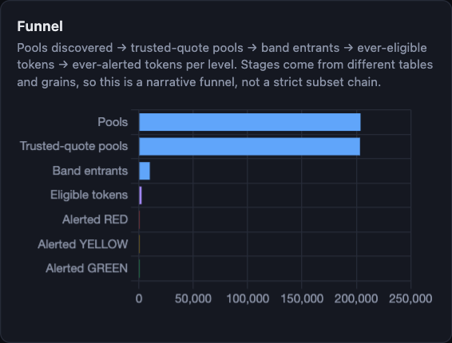
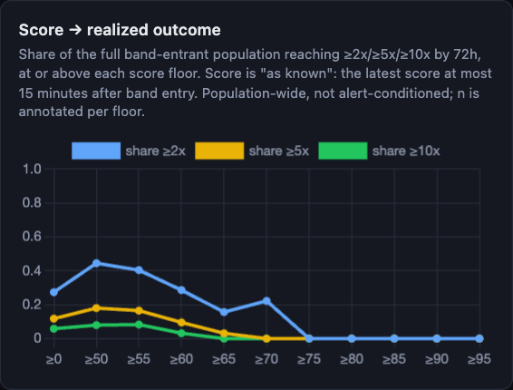
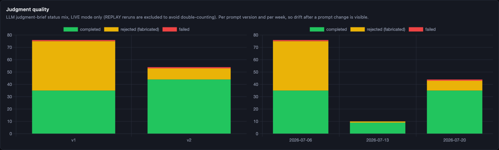
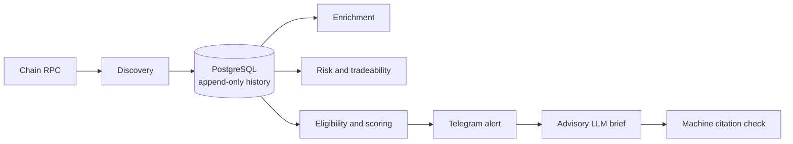

# Assay

[](https://github.com/OlliverBarr/assay-portfolio/actions/workflows/ci.yml)

> Launch forensics for Robinhood Chain. Evidence, not trades.

Assay is a TypeScript research prototype for newly created Robinhood Chain
liquidity pools. It ingests factory events, builds append-only market history,
checks deterministic safety and tradeability rules, scores candidates, and
sends explainable Telegram research alerts. An optional LLM brief runs only
after alert delivery and must cite machine-verifiable snapshot rows.

**Portfolio status.** A production trial ran during July 2026. The live stack
is intentionally paused, and this source repository contains no production
data, credentials, recipient data, or deployment host details. The current
model is an in-sample research result, not out-of-time validated.

## Evidence

The July 2026 production snapshot contained 9,260 labeled 72-hour band-entry
rows and 156 realized >=10x outcomes. The four-component score was rebuilt
from that population. These are historical, in-sample observations, not
forward-performance claims. See [the current status](docs/current-status.md)
and [the scoring model](docs/scoring-model.md) for scope and limitations.

The checked-in screenshots and artifacts show the real system outputs without
Telegram recipient data. The `bun run demo` command uses only one fictional,
local candidate.







## Design



Key constraints:

- Factory-event discovery is restart-safe. Cursors advance only after the full
  range persists.
- Market, risk, score, and alert records are append-only.
- Missing, stale, or unknown risk data is never silently converted to PASS.
- Eligibility and ranking are separate. A high score cannot override a failed
  safety gate.
- The advisory LLM cannot gate, delay, edit, or suppress an alert.
- The system has no wallet integration, signing path, custody path, or order
  execution path.

## Run it

### Verify the source

```sh
bun install --frozen-lockfile
bun run typecheck
bun run lint
bun run test
```

### Explore the local demo

```sh
bun run demo
# Open http://127.0.0.1:4600
```

The demo applies the real migrations to an ephemeral PGlite database and loads
one fictional `DEMO` candidate. It makes no RPC, Telegram, or LLM request.

### Self-host the worker

1. Copy `.env.example` to `.env`.
2. Set a dedicated archive-capable RPC URL and a strong `POSTGRES_PASSWORD`.
3. Keep Telegram delivery unset for dry-run mode, or set both Telegram values
   and a non-empty `TELEGRAM_JOIN_CODE`.
4. Run `docker compose up -d --build`.

See [DEPLOY.md](DEPLOY.md) for the hardened deployment procedure. The dashboard
is local-only and unauthenticated by design. Do not expose it to the internet.

## Safety and scope

Assay is an independent research and engineering project. It is not affiliated
with or endorsed by Robinhood, Uniswap, Telegram, Alchemy, or OpenAI.

**Not financial, investment, legal, or tax advice.** Nothing in this repository
is a recommendation, solicitation, or promise of performance. Token contracts
and market data are adversarial inputs. Independently assess all risks before
taking any action.

## Documentation

- [Architecture](docs/architecture.md): package boundaries and invariants.
- [Scoring model](docs/scoring-model.md): eligibility, alert tiers, and change protocol.
- [Data sources](docs/data-sources.md): verified addresses and source policy.
- [Current status](docs/current-status.md): historical results and known limits.
- [Deployment](DEPLOY.md): self-hosting and backup controls.

## Authorship

I designed the product contract, package boundaries, schemas, failure
invariants, evaluation rules, and operator workflow. I used an agentic coding
harness for implementation under those contracts, then reviewed, tested,
operated, and validated the resulting system against Robinhood Chain.
