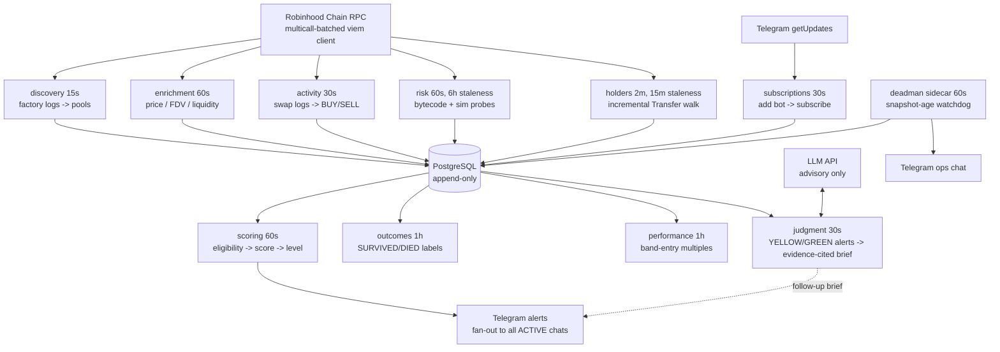

# Architecture

One Bun process (`apps/worker`) runs ten independent poll loops against
PostgreSQL and a single RPC endpoint. Every loop is restart-safe: state lives
in the database (cursors, append-only snapshots), never in memory. A crash or
redeploy resumes exactly where the data says it stopped.

## Loops

| Loop | Cadence | Reads | Writes |
|---|---|---|---|
| discovery | 15s | factory `PairCreated`/`PoolCreated` logs, chunked | `pools`, `chain_cursor` (two-watermark) |
| enrichment | 60s | pool state via multicall (active set + idle lane) | `pool_snapshots` (append-only), token metadata |
| activity | 30s | swap logs for trusted pools | `pool_swap_events`, `pool_activity_snapshots`, `activity_cursor` |
| risk | 60s / 6h staleness | bytecode, EIP-1967 slots, explorer verification, router/quoter round-trip probes incl. slippage curve | `token_risks`, `trade_simulations` |
| holders | 2m / 15m staleness | ERC-20 Transfer logs, incremental from `tokens.holder_scan_block` | `token_holders`, `token_holder_snapshots` |
| scoring | 60s | latest snapshot per signal, trajectory/retention/cohort/deployer queries | `token_eligibility_results`, `token_score_results` (incl. throttled GRAY shadow rows), `alerts_sent`, Telegram |
| outcomes | 1h | snapshot series per due pool | `token_outcomes` (SURVIVED/DIED at 24h/72h) |
| performance | 1h | snapshot series + entry-time signal reconstruction | `token_performance` (max multiple/drawdown per band entry) |
| subscriptions | 30s | Telegram `getUpdates` (sole consumer, persisted update-id cursor) | `telegram_subscriptions`, `telegram_cursor` |
| judgment | 30s | undelivered-brief YELLOW/GREEN alerts (per-token re-brief cooldown, escalation bypass), evidence bundle as of `sent_at`, typed history tools, LLM API | `judgment_briefs`, `judgment_tool_calls`, `judgment_citations`, follow-up Telegram message |

Expensive signals are band-prioritized (see decisions.md 2026-07-12): the
holders, risk, and scoring selections serve pools whose latest snapshot FDV
sits inside the watch band FIRST, through a bounded band lane
(`HOLDERS_BAND_LIMIT`, `RISK_BATCH_LIMIT`), then a bounded backlog lane of
young pre-band pools (`HOLDERS_BACKLOG_LIMIT`). Staleness is evaluated in
SQL, newest-created first. Global staleness sweeps over the full active set
are reserved for the cheap loops (enrichment, activity).

Alert delivery fans out to the static `TELEGRAM_CHAT_ID`. Self-service
subscriptions are disabled unless `TELEGRAM_JOIN_CODE` is non-empty. With a
code, a new chat starts PENDING and must send `/join <code>` before it becomes
ACTIVE. Per-chat failures remain isolated, and a kicked or blocked bot
auto-unsubscribes the chat.

The judgment loop is strictly downstream of `alerts_sent`: an alert is
committed and delivered before any LLM runs, so the advisory layer can never
gate, delay, or alter what surfaces. Briefs cite append-only snapshot rows by
id; a brief that fails machine citation-checking is recorded and never sent.

A separate process, `deadman`, runs as a compose sidecar: it pages Telegram when
the newest `pool_snapshots.captured_at` goes stale (worker, RPC, or DB down),
with its own optional ops chat (`DEADMAN_CHAT_ID`) — never fanned out.

## Packages

- `@assay/chain` — chain config, viem client (Multicall3 batching, retry
  classification), event ABIs, block-range log reads. No product logic.
- `@assay/discovery` — factory ingestion, two-watermark cursor, idempotent
  pool inserts.
- `@assay/enrichment` — adversarial metadata reads, WAD price math, USD
  anchoring (WETH/USDG), FDV/liquidity, two-lane active-set selection.
- `@assay/activity` — swap decoding, BUY/SELL classification, rolling
  buyer/flow windows, buy-shape metrics (Gini/entropy/repeated-size).
- `@assay/risk-engine` — verification, proxy + privileged-permission
  detection, route simulation with sell-slippage curve, explainable
  PASS/FAIL/UNKNOWN/ERROR/STALE verdicts.
- `@assay/holders` — incremental Transfer-log balance netting, adjusted
  concentration, float ratio, deployer provenance.
- `@assay/scoring` — pure functions: 12-rule eligibility gate, 0–100
  explainable opportunity score, GRAY/RED/YELLOW/GREEN stoplight classification with
  invalidation caps (liquidity collapse, simulation regression).
- `@assay/alerts` — message formatting, cooldown/escalation dedup, Telegram +
  dry-run transports.
- `@assay/judgment` — advisory LLM research briefs: evidence-bundle assembly
  (as-of reconstruction, provenance tagging, untrusted-string fencing), typed
  read-only history tools with audited call traces, machine-checked evidence
  citations, prompt registry, realized-outcome taxonomy, replay/eval scoring.
  Never on the alert path.
- `@assay/database` — Drizzle schema, migrations, every query. All other
  packages go through it; none open their own connections.

### Analytics dashboard

`apps/dashboard` is a separate, read-only Fastify app (`bun run dashboard`,
binds `127.0.0.1:4600` by default): all aggregation is SQL-side in the
`@assay/database` analytics module, so the dashboard itself holds no
business logic and opens no RPC connections. It is never on the alert
path (queries `@assay/database` only, same as every other app) and is not
part of `docker-compose.yml`; it is a local analysis tool pointed at any
`DATABASE_URL`.

## Cost model

RPC spend scales with launch activity, not pool count: full-cadence signal
refresh only for the **active set** (pools <72h old or valued inside the
watch band), a 6h idle lane for re-detection of everything else, Multicall3
batching for state reads, and per-token holder-scan cursors so Transfer
history is walked once, then incrementally.

## Invariants

- Market history is append-only; nothing overwrites a prior snapshot.
- Cursors advance only after their range is fully persisted.
- Null/UNKNOWN is never treated as PASS; missing data cannot make a token
  more alertable.
- Trajectory-style signals are forward-only from first observation — gaps are
  recorded, never inferred across.
- Calibration datasets (`token_outcomes`, `token_performance`) cover the full
  observed population, never conditioned on what the system alerted.
- The LLM judgment layer is advisory-only: it runs strictly after alert
  delivery, its tool arguments never carry attacker-controlled strings, and
  its claims must cite verifiable append-only rows.

## Deployment

Docker compose on a single 4GB VPS (see `DEPLOY.md`): `postgres:16` with a
named volume, the worker image (Bun, non-root), and the deadman sidecar, all
`restart: unless-stopped`. Operator tooling runs inside the worker container:
`bun run decide | feedback | calibrate | validate:*`.
