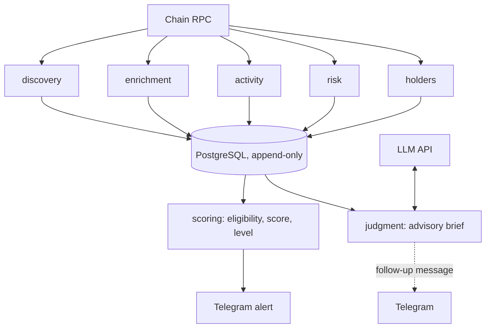

# Assay Engineering Case Study

> Historical production evidence, captured through 2026-07-30. The worker is
> paused. The measurements below are in-sample research observations, not
> future-performance claims or investment advice.

## what this is not

assay is not a trading bot. It never places an order, never holds a key
with transfer authority, and has no code path from "the model said
RESEARCH" to anything executing on-chain. It's not a signals service
either: nobody downstream gets a buy call. What it produces is evidence:
append-only snapshots of a token's price, liquidity, holder distribution,
and contract risk over time, plus an argued, machine-verified research
brief for the handful of launches that clear a deterministic bar. A human
reads the brief and decides. That's the whole loop.

## the problem

Robinhood Chain launches somewhere between 8,000 and 16,000 trusted-quote
pools a day. Almost all of them are dead within hours: no liquidity, no
buyers, or an obvious rug. You can't manually review that volume, and you
don't need to: the vast majority never enter a valuation range worth
looking at. What's interesting is a narrow band: pools crossing roughly
$10k–$100k estimated fully-diluted value while still showing real
liquidity, distributed buyers, and no known critical contract failure.
Small enough for a person to actually research, if something upstream can
find it reliably.

That split drove the design stance: detection has to be complete and
deterministic (every relevant pool ingested from factory logs, every
signal computed the same way every time, nothing silently dropped).
Judgment, on the other hand, can be argued. Once a candidate clears the
deterministic bar, there's room for something that reads messier evidence
(buyer behavior, contract shape, comparison to prior launches) and
writes an actual thesis instead of a threshold check. Different problems,
treated as different subsystems, with a hard boundary between them.

## two halves, one firewall

The deterministic half is ten poll loops against PostgreSQL and one RPC
endpoint, all restart-safe (state lives in the database, never memory,
so a crash or redeploy resumes exactly where the data says it stopped):
discovery watches factory logs, enrichment prices pools and computes
FDV, activity classifies swaps into BUY/SELL, risk simulates sell paths
and reads contract permissions, holders walks Transfer logs for
concentration, scoring gates eligibility and assigns a 0–100
explainable score, outcomes/performance label what happened to every
pool that crossed the band whether or not it ever alerted, and
subscriptions manages who gets Telegram alerts. All ten write
append-only history: nothing overwrites a prior snapshot, and a missing
or `UNKNOWN` value is never treated as `PASS`; it can only fail the
gate that needed the number.



The advisory half is one more loop: for each YELLOW/GREEN alert, an LLM
turns the evidence as of alert time into a structured brief: a thesis,
three ranked risk calls, disconfirming evidence, a confidence number, and
a `RESEARCH | WATCH | PASS` recommendation. It's explicitly not permitted
to be the authoritative judge of anything load-bearing. The project's own
internal spec is blunt about it:

> Deterministic systems before LLM judgments... An LLM must never be the
> authoritative judge of contract safety, tradeability, or financial
> calculations.

The important part isn't the policy statement; policies get ignored
under deadline pressure. It's that the boundary is enforced by dataflow,
not a rule someone has to remember. The judgment loop only reads
`alerts_sent` rows, only starting after an alert has already committed
and gone out over Telegram; there's no path where brief generation runs
before the alert, gates it, or delays it. If the LLM API is down or
misconfigured, the alert pipeline notices nothing; it isn't wired to.
Delete the judgment package entirely and the funnel runs identically.
That's the actual test of "advisory-only": not a comment in the code,
but whether the dependent subsystem's death changes anything upstream.
It doesn't.

## machine-checked citations

The failure mode this is built to prevent isn't a bad recommendation;
it's a *confident, plausible-sounding, factually wrong* one, the default
failure mode of an LLM reasoning over structured data. So every
load-bearing claim in a brief carries a pointer, not just prose:

```ts
export interface EvidencePointer {
  readonly table: string;
  readonly rowId: string;
  readonly field: string;
  readonly claimedValue: string;
}
```

The model asserts `table[rowId].field === claimedValue`. After
generation, code re-fetches every cited row and compares: no trust
extended to the model's own recollection of what it just read. Citations
resolve only against a fixed allow-list of append-only tables
(`pool_snapshots`, `token_risks`, `trade_simulations`,
`token_holder_snapshots`, and similarly historical rows); mutable tables
like `tokens` are excluded on purpose: a citation has to point at a fact
true and provable at a specific moment, not at whatever a row currently
says. A brief citing a row, field, or value that doesn't match gets one
verdict:

```ts
export interface CitationReport {
  readonly loadBearingFailures: number;
  readonly verdict: "OK" | "REJECT";
}
```

`REJECT` on any load-bearing failure means the brief is persisted as
`REJECTED_FABRICATED_CITATION` and never delivered, but it isn't thrown
away. It stays in `judgment_citations` forever, so the fabrication rate
is a real, queryable number, not a vibe.

The same discipline extends to the model's context tools: eight fixed,
read-only functions (comparable launches, base rates, deployer history,
liquidity trajectory, slippage at size, cohort percentiles, market
series, cited-row fetch), every argument numeric or enum,
`additionalProperties: false`. No free-text SQL parameter exists
anywhere, which matters because a token's name, symbol, and website text
flow into the evidence bundle and are fully attacker-controlled at
deployment time; they're tagged with provenance (`CHAIN_NUMERIC` /
`CHAIN_DERIVED` / `ATTACKER_STRING`), length-capped, and rendered only
inside a fenced block with an untrusted-data preamble, never
interpolated into a system prompt or tool argument. A 13-test canary
suite in CI exercises four adversarial payload shapes (a fake
fence-close plus forged system instruction, a fabricated tool-call JSON
blob, bidi-override/zero-width Unicode, a plain jailbreak phrase),
asserting clean and poisoned bundles render identically outside the
fence with identical tool-call traces. Each was checked red-then-green:
weaken the production code, confirm the assertion catches it, restore.

## how it was built

I specified the funnel order, eligibility discipline, failure invariants, and
FDV band as a frozen contract. I defined the types, schema, and migrations
before implementation packages consumed them. I then used an agentic coding
harness to implement against those contracts in parallel where interfaces made
that safe.

My role included the product contract, architecture, review, test strategy,
live validation, production operation, and incident response. The harness
produced implementation under explicit constraints. I reviewed and shipped the
result after automated checks and live RPC and database smoke tests.

The first was a production crash-loop. Active-set scheduling (which
pools get full-cadence refresh versus a slow idle-lane re-check) used
`discovered_at` as its youth signal. Fine until the initial backfill
inserted ~62,000 historical pools in one pass, all timestamped with the
same recent `discovered_at`. Every one read as "young," the full-cadence
lane degenerated into the entire historical population, enrichment
overnight took hours and starved fresh launches, and once the count
crossed 65,533 the one-bind-parameter-per-pool token lookup blew past
postgres's hard 65,534-parameter cap, crashing the worker every restart.
The dead-man watchdog paged on the resulting snapshot staleness. Root
cause: a category error; `discovered_at` measures when *this system*
found the pool, not when it was created. Fixed with on-chain age
(`created_at_block` against a timestamp-binary-searched cutoff) and
chunked queries/inserts on every population-scaled path. Verified live:
zero crashes, sub-second snapshot age, `stale: false`.

The second was quieter, and harder to notice without the eligibility
discipline forcing it into the open. The sell-simulation probe measured
slippage by quoting a round trip but had no baseline for what a
frictionless round trip should return, so `effectiveSellLossBps` stayed
`null` even on an otherwise-passing simulation, permanently, so the
`maxEffectiveSellLoss` rule depending on it could never fire, for
anyone, ever. Not a crash: a silently-unsatisfiable gate, surfaced only
because the eligibility gate treats missing data as a hard fail, never
an assumed pass: a rule that can never see a non-null input just
refuses to pass forever, visibly, instead of hiding inside a
`try { } catch { pass = true }`. Fixed by making the probe's own quote
input the round-trip baseline. Measured losses then landed right on the
theoretical fee floors for both DEX versions (59 bps V2 ≈2×30bps; 199
bps V3 ≈2×1% tier): what a correct measurement should produce, an
unlikely coincidence otherwise.

Neither bug is exotic; both are the kind that ships quietly in systems
without hard invariants. They didn't ship quietly here because "missing
data never passes" and "an unreachable alarm pages someone" aren't
code-review checklist items; they're structural properties the harness
was told to build against, and the tests enforce.

## the eval loop is the product

The part I care about most is that the judge doesn't grade its own
homework. `token_outcomes` (SURVIVED/DIED at 24h/72h) and
`token_performance` (peak multiple, drawdown, minutes-to-peak per band
entry) label the realized outcome of *every* pool that crossed the
reference band, deliberately not conditioned on whether the system
ever alerted, scored, or judged it. That was a call made for the
deterministic scoring model's own threshold calibration, and it means
ground truth for the LLM layer was already sitting there for free by
the time the judgment layer existed.

`bun run judge:replay` reconstructs the evidence bundle as it would have
looked when a historical pool first entered the band (same as-of
reads the performance labeler uses) and generates a brief against that
reconstructed past. Because history is append-only, "as of a past
timestamp" isn't an approximation; it's a `captured_at <= asOf` filter
against rows never mutated after insertion. Tools that can't be made
as-of-correct (cohort percentiles need the live population of
comparable-age pools, absent at replay time) report themselves
unavailable in replay rather than leaking present-day information into
a historical brief: the difference between a trustworthy eval number and
one that's unknowingly cheating.

`bun run judge:report` scores replayed briefs against the realized
taxonomy (`RUGGED` / `BLED` / `HELD_BAND` / `RUNNER`) per hashed prompt
version: Brier score on implied outcome probability, stated confidence
versus realized hit rate by decile, precision/recall per risk-tag
against realized failure modes (tags with no measured positives reported
as honestly unmeasured, never smoothed into a number), fabrication rate,
all with Wilson confidence intervals, because a 3-for-4 headline on
n=4 isn't a finding. `--from`/`--to` slicing computes headline numbers on
an out-of-time period that never fed prompt tuning.

A prompt tuned and measured on the same data looks better than it is; a
metric without its interval looks more precise than it is; both lie
with real numbers. The scoring model's own threshold-tuning rule (tune
on one period, confirm on a later untouched one, never on the data that
chose the parameters) applies identically to prompt iteration. No
separate, looser standard for "it's just an LLM eval."

## numbers

| metric | value |
|---|---|
| worker loops | 10 (discovery, enrichment, activity, risk, holders, scoring, outcomes, performance, subscriptions, judgment) |
| test suite | 817 tests, 66 files |
| injection canary tests | 13, across 4 adversarial payload shapes |
| citation fields checked per claim | table, rowId, field, claimedValue |
| RPC spend at steady state | ~$25–45/mo (Alchemy pay-as-you-go, ~50–90M compute units/month) |
| judgment briefs generated per day | single-to-low-double digits (YELLOW/GREEN only) |
| brief cost, projected | [INFERENCE, not measured] roughly $1–5/day at frontier per-request pricing, given stated daily brief volume and the design call that one strong model per brief is negligible next to RPC spend |
| launches monitored | 203,865 pools discovered, 203,345 against a trusted quote (production DB, final 2026-07-27 backup) |
| band-crossing pools labeled | 9,998 pools labeled in `token_performance` (9,264 label rows at the 72h horizon) |
| deterministic filter precision | at the score-80 delivery floor: unmeasured, n = 0 (no band entrant carried an as-of entry score ≥ 80 in the 7 live days after the 2026-07-20 rebuild). At score ≥ 50: 44.4% of band entrants reached ≥2x within 72h (n = 189, Wilson 37.5–51.6%) versus the 27.4% all-scored baseline (n = 808); score ≥ 65 is n = 32, too thin to read |
| judge hit-rate, prompt v1 | 79.3% of scored v1 briefs realized RUNNER, peak ≥2x within 72h (23/29, Wilson 61.6–90.2%); the 50–60% stated-confidence bucket realized 84.0% (n = 25, Wilson 65.4–93.6%): under-confident, on a one-day, in-sample population |
| citation fabrication rate | v1: 56.1% of briefs rejected for fabricated citations (37/66 at the 72h slice, Wilson 44.1–67.4%); v2: 17.1% (7/41, Wilson 8.5–31.3%). Every rejected brief was blocked before delivery |
| median brief cost / latency, measured | latency: 11.4s median per brief (v2, 72h slice, n = 41); cost: unmeasured, `costUsd` was never recorded by the live deployment |

RPC spend and the test count are measured, current as of this write-up;
daily brief volume comes from the project's decision log. The remaining
rows were measured on 2026-07-30 by running this repo's own
`judge:report` and analytics queries against the restored final
production backup (2026-07-27, append-only history). The judge numbers
score the live brief population (2026-07-11 to 2026-07-21) against
realized labels; that population is in-sample for prompt tuning
purposes, not an out-of-time replay.

## what's next

The judgment layer has been live-smoked end to end: a seeded historical band
entry replays into a brief with every citation machine-verified, and
`judge:report` produces sliced calibration buckets and Wilson bounds. The
remaining work is an honest out-of-time replay over a frozen period. The
historical v1-to-v2 fabrication drop is real and machine-checked, but it is
in-sample. This public case study keeps that limit explicit.
